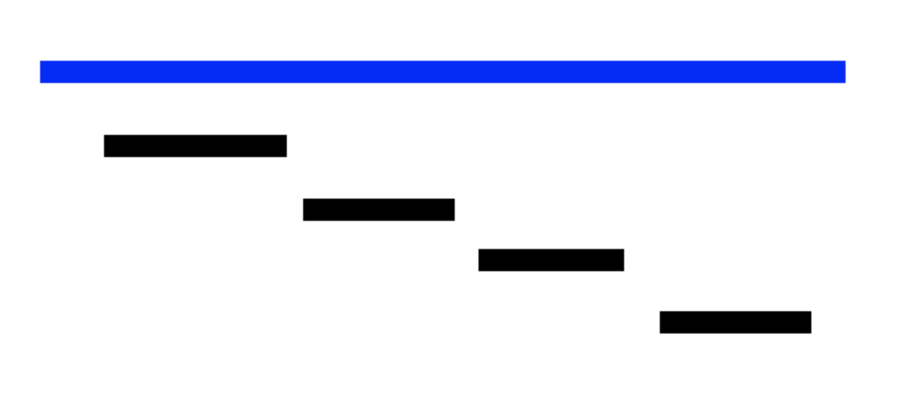
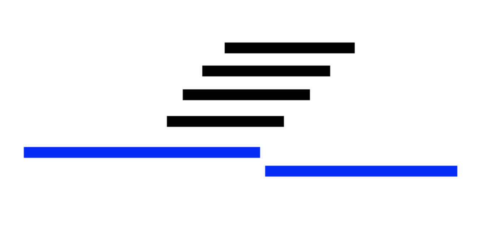

# 1931 회의실 배정

## 알고리즘

- 정렬
- 그리디

## 접근법

- 그리디 문제이므로 단순하게, 탐욕적으로 접근해야 한다.
- 이 문제의 요점은 **가장 많은 회의를 해야 한다**는 것이다.
- 가장 많은 회의를 하기 위해선 **빠르게 회의를 배정**해 나가야 한다.

1. 시작시간 기준 정렬 후 **빠르게 시작하는 회의를 먼저** 배정한다.
    
    아래 사진에서 가장 많은 회의를 배정하는 방법은 검은색에 해당하는 회의를 모두 배정하는 것이다.
    
    그러나 시작시간을 기준으로 회의를 배정하게 되면 파란색 회의가 가장 먼저 잡히게 되고 나머지 회의는 시간이 겹쳐 배정할 수 없게 된다. 빠르게 시작한다고 해서 빠르게 끝나는 것은 아니기 때문이다.
    
    따라서 시작시간을 기준으로 배정하는 것은 최적해를 보장하지 못 한다.
    
    
    
2. **가장 짧은 회의를 먼저** 배정한다.
    
    1번의 반례에 대응할 수 있는 방법은 짧은 회의를 먼저 배정하는 것이다.
    
    회의시간을 기준으로 정렬하게 되면 1번의 경우 최적해를 도출할 수 있다.
    
    다만 이 방식으로는 아래 상황에서 최적해를 도출할 수 없다.
    
    아래에서 최적해는 파란색 회의 두 개를 배정하는 것이다. 검은색 회의들 모두가 다른 모든 회의와 겹치기 때문에 저 중 하나라도 배정이 된다면 다른 회의는 선택할 수 없기 때문이다.
    
    그런데 2번 방법인 짧은 회의를 먼저 배정하게 된다면 검은색 회의가 먼저 배정될 것이고 최적해를 도출할 수 없게 된다. 따라서 이 방법도 최적해를 보장하지 못 한다.
    
    
    
3. **빨리 끝나는 회의를 먼저** 배정한다.
    
    결론적으로 이 방법이 가장 많은 회의를 배정할 수 있는 방법이다.
    
    첫 번째 방법에서 앞에서부터 많은 회의를 채워 나가기 위해 빨리 시작하는 회의부터 배정하였는데, 빨리 시작한다고 빨리 끝나는 게 아니기 때문에 최적의 방법이 아니었다.
    
    그러나 반대로, 빨리 끝나는 회의를 먼저 배정하게 되면 다음 회의를 최대한 빠르게 배정할 수 있게 되고, 가장 많은 회의를 배정할 수 있게 된다.
    
    따라서 회의 목록을 종료시간 기준으로 오름차순 정렬하면, 앞에서부터 배정 가능한 회의들만 배정해 나가도 가장 많은 회의를 배정할 수 있게 된다.